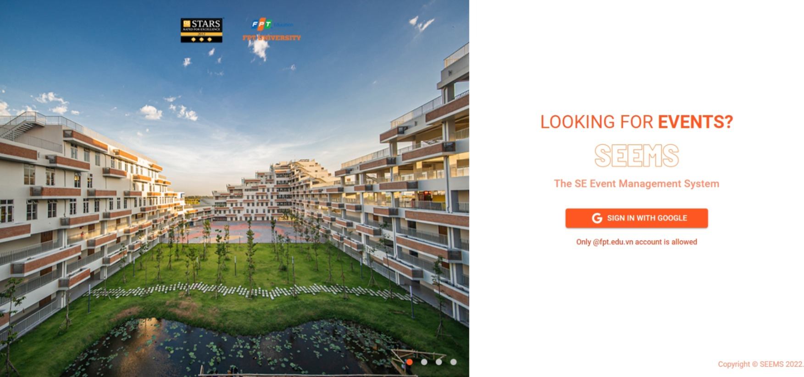
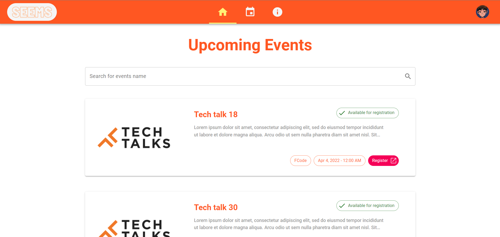
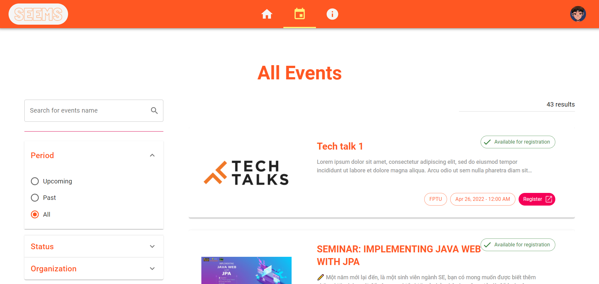
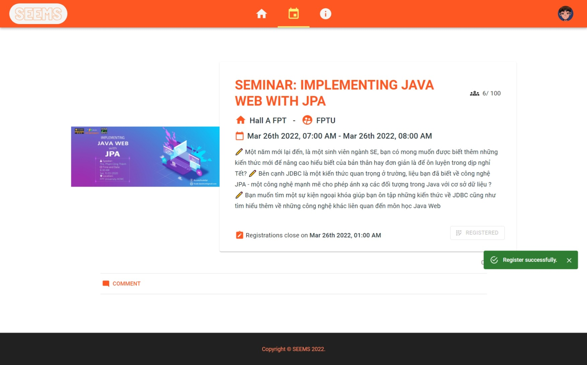
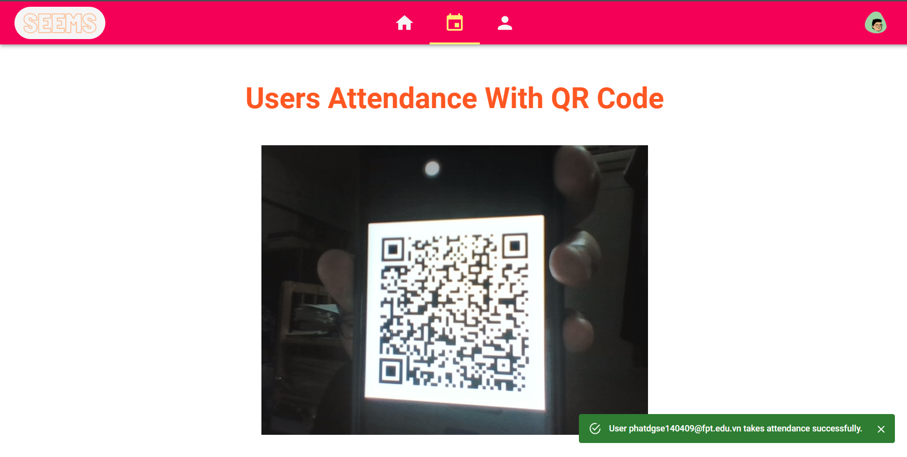
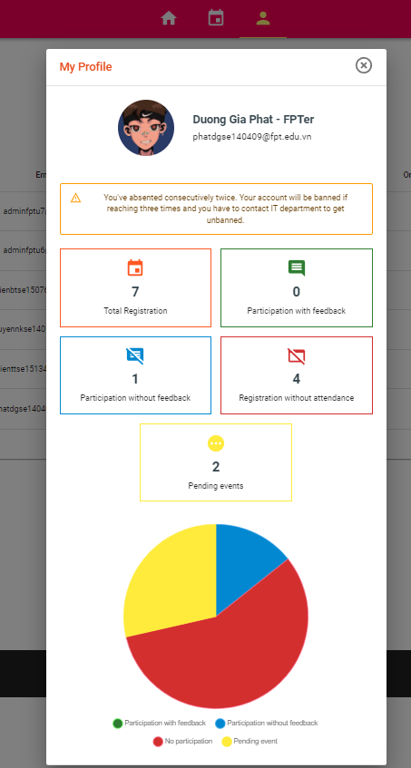

# &nbsp; SEEMS - SE Event Management System

## What is SEEMS?
- An event management system for FPTU student of SE major.
- This application is the final project of my college subject SWP391 - 	Software development project.
- On the other hand, this project is for practicing working in group with `Jira`, `GitHub` as well as some popular framework like `React` and `ASP.NET`.
- SEEMS is compatible with `Desktop view` only (cannot use with `Mobile or Tablet view`).
- This application `can be deployed to use in local` or `production`.

## Main Features
- Organizer & Admin can create events and perform take attendance for participants.
- User receives email notifications with QR Code of registered events for taking attendance.
- User can give feedback of events and Organizer & Admin can review to improve the event hosting.
- Admin manages User and Organizer role as well as information.

**For more details, check out our [SEEMS document](./docs/SWP391-Document-SEEMS.pdf).**

## Technology
- Frontend
  - React - A JavaScript library for building user interfaces
  - Recoil - State Management
  - react-qr-scanner - Library for scanning QR Code.
- Backend
  - Firebase - Storage.
  - Microsoft SQL Server - Database Engine/Server.
  - ORM - Entity Framework with Code First Approach

## Some preview images
&nbsp;
&nbsp;
&nbsp;

## How to run
**System Requirement: .NET CLI 5**

Before jump in to run this application, you need to a few setup for Front-end and Back-end:
- Front-end
  - Go to Client folder in SEEMS (this is where we store our Front-end application).
  - Create a `.env.local` file with content exactly like `.env.example` file content.
  - Change `Firebase` and other value (if needed) to your own setting.
- Back-end
  - Go to SEEM folder.
  - Execute `setup.sh` file and do all 3 options to setup.

To start project, you run the below command
```
dotnet run --project .\SEEMS\
```

The command will start the Back-end of the app only.
=> To start the Front-end of the app, you can just access to Backend URL (default is http://localhost:5148).

# License & copyright

© Kirin Tran, Le Tien Thinh, Nguyen Khoi Nguyen, Bui The Hien, Duong Gia Phat, FPT University TP.HCM
Licensed under the [MIT LICENSE](LICENSE).
